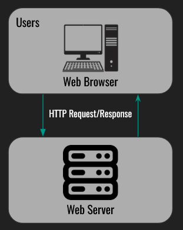

# robinclone - 1-base-app

## Goal

The goal of this step is to create the base application.

The application should be able to:
- Handle user registration/login
- Perform requests to an API to get stock information
- Users can view their portfolios

## High Level Design

All functionality will be contained and run in a single server as shown:

|  |
|:-:|
| _Figure 1: High-level design for base app_ |

The store for user information will be a local SQLite database contained within the web server.

## Web Functionality

The web functionality can be broken down into the following pages:

- `/auth/login`: The login page of the application
- `/auth/register`: The registration page
- `/`: The home page of the application
    - Users must be logged in to view this page
    - Non-logged in users will be redirected to `/login`
- `/user/{username}`: The portfolio page for the user
    - Only the user can view their portfolio
    - Others will get a `403 forbidden`
- `/symbol/{ticker}`: The page for a given ticker symbol
    - This can be created dynamically

## API Functionality

- `/api/symbol?ticker={ticker}`: The lookup for stock information
    - Response is as follows:

Status Code: `200`
```JSON
{
    "symbol": "AAPL",
    "price": 34.12
}
```

Status Code: `400`
```JSON
{
    "symbol": "AAPL",
    "error": "Error message"
}
```

## Database Schema

The local sqlite database will have the following schemas:

```SQL
CREATE TABLE user (
    id INTEGER PRIMARY KEY AUTOINCREMENT,
    username TEXT UNIQUE NOT NULL,
    password TEXT NOT NULL
);
```